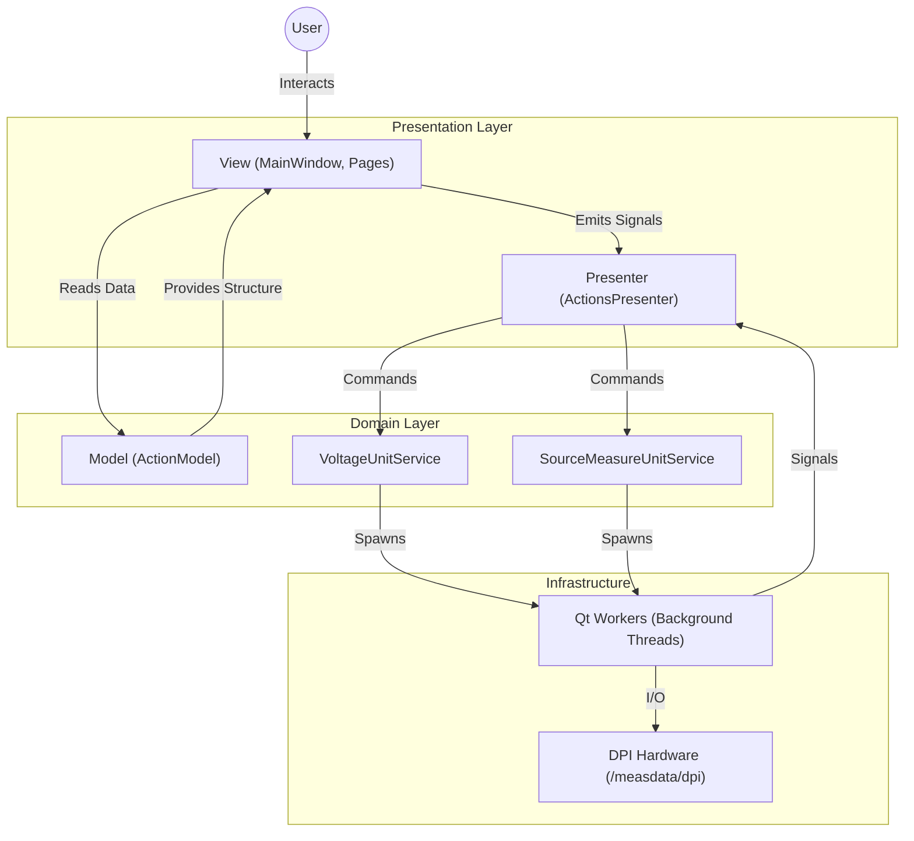

# HardwareGUI


A PySide6 application for controlling and calibrating DPI hardware at the Institute of Microelectronics. Built with a **Model-View-Presenter (MVP)** architecture, it features type-safe configuration, asynchronous hardware communication, and a modular UI.

---

## Key Features

- **Automated Calibration**: Python-based and onboard firmware calibration workflows.
- **Multi-Hardware Support**: Voltage Unit and Source Measure Unit (SMU) with extensible architecture.
- **Real-Time Monitoring**: Live status updates from hardware devices.
- **Visual Feedback**: Real-time plotting and thumbnail generation for calibration results.
- **Modular Design**: Extensible architecture for adding new hardware types (see [Adding Hardware Guide](.agent/knowledge-base/adding-hardware.md)).
- **Portable Deployment**: Automated setup scripts for zero-configuration deployment.

---

## Requirements

### System Requirements
- **OS**: Linux (X11 or Wayland)
- **Python**: 3.12 or later
- **Hardware Access**: Network access to DPI hardware (default scope IP: `192.168.68.154`)

### External Dependencies
The application relies on the standard DPI package library at `/measdata/dpi`:
- `dpi` (Core framework)
- `dpivoltageunit`
- `dpimaincontrolunit`
- `dpiarrayextensionunit`
- `dpipowersupplyunit`
- `dpisamplingunit`
- `dpisourcemeasureunit`

> **Note**: These packages are loaded dynamically via `PYTHONPATH` by the launcher script. You do not need to install them manually.

---

## Quick Start

### 1. Installation

The `setup.sh` script automates the entire installation process, creating a dedicated virtual environment with `uv`.

```bash
# Clone the repository
git clone https://github.com/yourusername/HardwareGUI.git
cd HardwareGUI

# Run setup (handles venv creation and dependencies)
./setup.sh
```

### 2. Running the App

Always use the provided `run.sh` script to launch the application. It handles crucial environment setup (PYTHONPATH, variable updates) that direct Python invocation would miss.

```bash
./run.sh
```

---

## Architecture

The application follows a **Model-View-Presenter (MVP)** pattern to separate UI logic from business rules and hardware communication.

### High-Level Overview



### Component Roles

| Layer | Component | Responsibility |
|-------|-----------|----------------|
| **View** | `MainWindow`, `BasePage` | Renders UI, capturing inputs, displaying data. Reads structure from Model. |
| **Presenter** | `ActionsPresenter` | Orchestrates logic. Receives view signals, routes to appropriate service. |
| **Model** | `ActionModel` | Static data structure defining application hierarchy (read-only). |
| **Service** | `VoltageUnitService`, `SourceMeasureUnitService` | Handles long-running business logic and hardware communication. Each hardware type has its own service. |

### Configuration System
Configuration is centralized in `src/config.py` using immutable dataclasses (`frozen=True`) to prevent runtime modification and side effects.

---

## Development Workflow

The project uses modern Python tooling for quality assurance.

### Code Style & Quality
We use `ruff` for linting/formatting and `mypy` for static analysis.

```bash
# Format code (Black compliant)
uv run ruff format .

# Run linting check
uv run ruff check .

# Run static type checking
uv run mypy src/
```

### Running Tests
Unit tests use `pytest` with `pytest-qt` for GUI interaction.

```bash
# Run all tests
uv run pytest

# Run with coverage report
uv run pytest --cov=src
```

### Qt Resources
Icons and assets are compiled into a Python module. If you modify `.qrc` files or add icons:

```bash
# Regenerate resources
./scripts/build_resources.sh
```

---

## Troubleshooting

### Common Issues

| Issue | Cause | Solution |
|-------|-------|----------|
| **ModuleNotFoundError: No module named 'dpi'** | Missing PYTHONPATH | Always run using `./run.sh`, not `python src/main.py`. |
| **Qt Platform Plugin Error** | Missing system libs | Install `libxcb-cursor0` and `libxkbcommon-x11-0`. |
| **Permission Denied** | Script execution rights | Run `chmod +x setup.sh run.sh scripts/*.sh`. |

### Debugging
To enable verbose debug logging, export the `LOG_LEVEL` variable before running:

```bash
export LOG_LEVEL=DEBUG
./run.sh
```

---

## Project Structure

```bash
HardwareGUI/
├── src/
│   ├── config.py                 # Centralized configuration
│   ├── main.py                   # Entry point
│   ├── populate_items.py         # Hardware & action definitions
│   ├── device_scripts/           # Symlinks to DPI dev scripts (generated by setup.sh)
│   │   ├── setup_cal.py          #   → Voltage Unit scripts
│   │   ├── smu_*.py              #   → Source Measure Unit scripts
│   │   └── su_*.py               #   → Sampling Unit scripts
│   ├── gui/                      # View layer
│   │   ├── main_window.py
│   │   ├── scripts/              # Hardware-specific pages
│   │   │   ├── base_page.py      #   Abstract base for all pages
│   │   │   ├── voltage_unit/     #   VU pages (Session, Calibration, Test, Guard)
│   │   │   ├── source_measure_unit/  # SMU pages (Setup, Verify, Cal Measure, Cal Fit)
│   │   │   └── sampling_unit/    #   SU pages (Setup, Verify, Cal Measure, Cal Fit)
│   │   ├── services/             # UI services (StatusBar, SharedPanels)
│   │   └── widgets/              # Reusable UI components
│   ├── logic/                    # Business logic
│   │   ├── presenter.py          # MVP Presenter with page factory registry
│   │   ├── services/             # Hardware service layer
│   │   │   ├── vu_service.py     #   Voltage Unit service
│   │   │   ├── smu_service.py    #   Source Measure Unit service
│   │   │   └── su_service.py     #   Sampling Unit service
│   │   └── model/                # Data Models
│   └── resources/                # Icons and assets
├── tests/                        # Unit and integration tests
├── setup.sh                      # One-time install script (creates symlinks)
├── run.sh                        # Application launcher (sets PYTHONPATH)
└── pyproject.toml                # Dependencies & tool config
```

### Supported Hardware

| Hardware | Service | Actions |
|----------|---------|--------|
| **Voltage Unit** | `VoltageUnitService` | Session & Coefficients, Calibration, Test, Guard |
| **Source Measure Unit** | `SourceMeasureUnitService` | Hardware Setup, Verify, Calibration Measure, Calibration Fit |
| **Sampling Unit** | `SamplingUnitService` | Hardware Setup, Verify, Calibration Measure, Calibration Fit |
