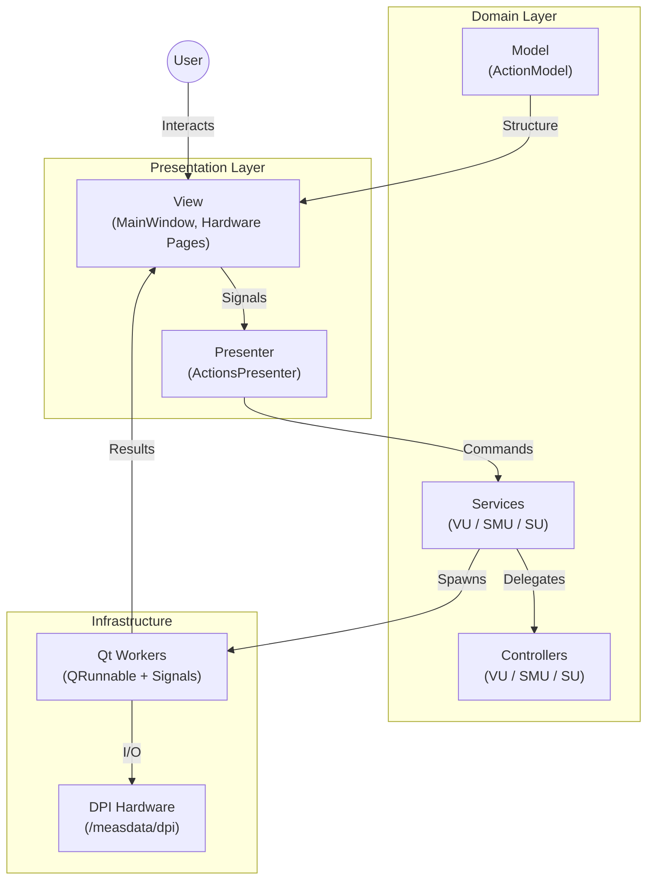

<div align="center">

# HardwareGUI

**Desktop application for controlling and calibrating DPI hardware at the Institute of Microelectronics.**

[](https://www.python.org/downloads/)
[](https://doc.qt.io/qtforpython/)
[](https://github.com/psf/black)
[](https://docs.astral.sh/ruff/)
[](LICENSE)

Built with **Model-View-Presenter (MVP)** architecture &bull; Type-safe configuration &bull; Async hardware communication

[Getting Started](#getting-started) &bull;
[Architecture](#architecture) &bull;
[Development](#development) &bull;
[Troubleshooting](#troubleshooting)

</div>

---

## Features

- **Multi-Hardware Support** — Voltage Unit, Source Measure Unit, and Sampling Unit with a plug-in architecture for adding new devices
- **Automated Calibration** — Python-based and onboard firmware calibration workflows with visual artifact generation
- **Real-Time Monitoring** — Live console output, status bar feedback, and thumbnail previews during operations
- **Simulation Mode** — Full UI testing without physical hardware (`--simulation` flag)
- **Modular Design** — Page factory registry (OCP), frozen dataclass configs, and service-controller separation
- **Zero-Config Deployment** — Automated `setup.sh` + `run.sh` scripts handle virtual environment, PYTHONPATH, and dependencies

---

## Getting Started

### Prerequisites

- **OS**: Linux (X11 or Wayland)
- **Python**: 3.12+
- **Network**: Access to DPI hardware (default scope IP: `192.168.68.154`)

> **Note**: The DPI package library (`/measdata/dpi`) is loaded dynamically via `PYTHONPATH` by the launcher script — no manual installation required.

### Installation

```bash
git clone https://github.com/yourusername/HardwareGUI.git
cd HardwareGUI
./setup.sh          # Creates venv with uv, installs dependencies
```

### Usage

```bash
./run.sh                    # Production mode (requires hardware)
./run.sh --simulation       # Simulation mode (no hardware needed)
```

> Always use `run.sh` — it sets up `PYTHONPATH` and environment variables that direct `python` invocation would miss.

---

## Architecture

The application follows a **Model-View-Presenter (MVP)** pattern with a layered service architecture:



### Layer Responsibilities

**View** (`gui/`) — Renders UI, captures user input, displays data. Hardware pages inherit from `BaseHardwarePage` which provides task lifecycle, artifact watching, and layout factories.

**Presenter** (`logic/presenter.py`) — Routes view events to services. Uses a `PAGE_FACTORIES` registry to map page IDs to factory functions, following the Open/Closed Principle.

**Services** (`logic/services/`) — Own hardware connection lifecycle and threading. Each service inherits from `BaseHardwareService` (a `QObject` ABC) which provides signals (`connectedChanged`, `inputRequested`, `instrumentVerified`), a `threading.Lock`, IP verification via `ping_instrument()`, input redirection (`provide_input` / `wait_for_input`), and the `require_instrument_ip` guard decorator.

**Controllers** (`logic/controllers/`) — Pure hardware logic with no threading or UI concerns. Return `OperationResult` (frozen dataclass) from every operation. All inherit from `HardwareController` ABC which defines `initialize_device`, `read_temperature`, and `perform_autocalibration`.

**Simulation** (`logic/simulation.py`) — `SimulatedVoltageUnitService`, `SimulatedSMUService`, and `SimulatedSUService` extend `BaseHardwareService` directly (no controller needed). They use `_simulate_work()` from the base class to print timestamped output and generate matplotlib artifacts via `SimulationArtifactGenerator`.

**Workers** (`logic/qt_workers.py`) — `FunctionTask` (`QRunnable`) wraps callables with stdout/stderr capture (`_EmittingStream`) and emits lifecycle signals via `TaskSignals`. The `run_in_thread()` helper submits tasks to the global `QThreadPool`.

**Configuration** — Centralized in `src/config.py` using nested frozen dataclasses (`AppConfig → UIConfig, HardwareConfig, ...`). Environment variable overrides supported for `LOG_LEVEL` and `LOG_FILE`.

---

## Project Structure

```
HardwareGUI/
├── src/
│   ├── main.py                        # Entry point (argparse, simulation mode)
│   ├── config.py                      # Centralized frozen-dataclass configuration
│   ├── populate_items.py              # Hardware & action descriptors
│   ├── gui/                           # View layer
│   │   ├── main_window.py             #   Frameless QMainWindow
│   │   ├── scripts/                   #   Hardware-specific pages
│   │   │   ├── base_page.py           #     Abstract base (task lifecycle, layouts)
│   │   │   ├── voltage_unit/          #     VU: Connection, Setup, Test, Calibration, Guard
│   │   │   ├── source_measure_unit/   #     SMU: Connection, Setup, Test, Calibration
│   │   │   └── sampling_unit/         #     SU: Connection, Setup, Test, Calibration
│   │   ├── services/                  #   UI services (StatusBar, SharedPanels, Tooltip)
│   │   └── widgets/                   #   Reusable components (Sidebar, Stacked, Panels)
│   └── logic/                         # Business logic
│       ├── presenter.py               #   MVP presenter + page factory registry
│       ├── simulation.py              #   Simulated services for --simulation mode
│       ├── controllers/               #   Hardware controllers (VU, SMU, SU)
│       │   └── base_controller.py     #     ABC + OperationResult dataclass
│       ├── services/                  #   Hardware service layer (VU, SMU, SU)
│       ├── model/                     #   Qt item models
│       └── qt_workers.py              #   FunctionTask / QRunnable with signal bridge
├── tests/                             # pytest + pytest-qt test suite
├── setup.sh                           # One-time install (venv, dependencies, symlinks)
├── run.sh                             # Application launcher (PYTHONPATH setup)
└── pyproject.toml                     # Dependencies, ruff, black, mypy, pytest config
```

### Supported Hardware

**Voltage Unit** — Session & coefficient management, output/ramp/transient testing, Python and onboard calibration, guard signal control.

**Source Measure Unit** — Device initialization, EEPROM calibration, relay control (IV converter, post-amplifier, highpass, input routing, VGUARD), saturation detection.

**Sampling Unit** — Device initialization, single-shot/transient/pulse measurements, MCU synchronization, trigger control.

---

## Development

### Code Quality

```bash
uv run ruff format .          # Format (Black-compatible)
uv run ruff check .           # Lint (Google docstring convention)
uv run mypy src/              # Static type checking (strict mode)
```

### Testing

```bash
uv run pytest                 # Run all tests
uv run pytest --cov=src       # With coverage report
uv run pytest -x -q           # Stop on first failure, quiet output
```

### Adding New Hardware

1. Create a controller in `logic/controllers/` inheriting `HardwareController`
2. Create a service in `logic/services/` managing connection lifecycle
3. Create GUI pages in `gui/scripts/<hardware_name>/` inheriting `BaseHardwarePage`
4. Register pages in `PAGE_FACTORIES` dict in `presenter.py`
5. Add action descriptors in `populate_items.py`

> See [Adding Hardware Guide](.agent/knowledge-base/adding-hardware.md) for detailed instructions.

### Regenerating Qt Resources

```bash
./scripts/build_resources.sh
```

---

## Troubleshooting

**`ModuleNotFoundError: No module named 'dpi'`** — Always run via `./run.sh`, not `python src/main.py` directly.

**Qt Platform Plugin Error** — Install missing system libraries: `sudo apt install libxcb-cursor0 libxkbcommon-x11-0`

**Permission Denied on scripts** — `chmod +x setup.sh run.sh scripts/*.sh`

**Debug logging** — `LOG_LEVEL=DEBUG ./run.sh`

---

## License

This project is licensed under the MIT License — see [LICENSE](LICENSE) for details.
