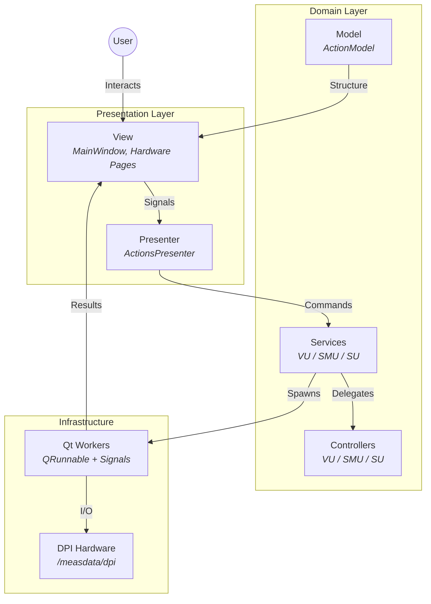

<div align="center">

# HardwareGUI

### Desktop control & calibration suite for DPI semiconductor test hardware

[](https://www.python.org/downloads/)
[](https://doc.qt.io/qtforpython/)
[](tests/)
[](https://docs.astral.sh/uv/)
[](https://docs.astral.sh/ruff/)
[](LICENSE)

Built for the **Institute of Microelectronics, TU Wien** &mdash; Bachelor thesis project

[Quick Start](#quick-start) &bull; [Architecture](#architecture) &bull; [Hardware Support](#hardware-support) &bull; [Testing](#testing) &bull; [Development](#development)

</div>

---

## The Problem

DPI hardware calibration involves dozens of manual steps across three instrument types&mdash;setting voltages, reading coefficients, triggering scope acquisitions, fitting correction curves, and writing EEPROM data. Doing this through bare Python scripts means no feedback during long-running operations, no artifact management, and no way to recover from errors mid-workflow.

## What This Project Does

HardwareGUI wraps the entire calibration and test pipeline in a Qt desktop application with real-time console output, live plot visualization, and structured artifact collection. Each hardware operation runs on a background thread with cancellation support, while the GUI remains responsive.

| Capability | Without HardwareGUI | With HardwareGUI |
|:---|:---|:---|
| **Calibration workflow** | Manual script execution, copy-paste parameters | One-click automated pipeline with visual feedback |
| **Error handling** | Script crashes, lost state | Graceful recovery, operation results, status bar |
| **Artifact management** | Manually save/rename plots | Timestamped auto-collection with thumbnail preview |
| **Hardware verification** | Manual ping, hope for the best | Network discovery, SCPI scanning, ping verification |
| **Multi-device support** | Separate scripts per device | Unified interface, plug-in page architecture |

---

## Quick Start

### Prerequisites

- **OS**: Linux (X11 or Wayland)
- **Python**: 3.12+
- **Network**: Access to DPI hardware (or use `--simulation`)

> The DPI library (`/measdata/dpi`) is loaded dynamically via `PYTHONPATH` in the launcher&mdash;no manual installation required.

### Installation

```bash
git clone https://github.com/Konoszaf1/HardwareGUI.git
cd HardwareGUI
./setup.sh          # Creates venv with uv, installs all dependencies
```

### Usage

```bash
./run.sh                    # Production mode (requires hardware)
./run.sh --simulation       # Simulation mode (no hardware needed)
```

> Always use `run.sh`&mdash;it configures `PYTHONPATH` and environment variables that direct invocation would miss.

---

## Architecture

The application follows **Model-View-Presenter (MVP)** with a layered service architecture that separates hardware I/O from UI concerns:


```mermaid
graph TD
    subgraph Presentation ["Presentation Layer"]
        View["View<br/><em>MainWindow, Hardware Pages</em>"]
        Presenter["Presenter<br/><em>ActionsPresenter</em>"]
    end

    subgraph Domain ["Domain Layer"]
        Model["Model<br/><em>ActionModel</em>"]
        Services["Services<br/><em>VU / SMU / SU</em>"]
        Controllers["Controllers<br/><em>VU / SMU / SU</em>"]
    end

    subgraph Infra ["Infrastructure"]
        Workers["Qt Workers<br/><em>QRunnable + Signals</em>"]
        Hardware["DPI Hardware<br/><em>/measdata/dpi</em>"]
    end

    User((User)) -->|Interacts| View
    View -->|Signals| Presenter
    Presenter -->|Commands| Services
    Services -->|Delegates| Controllers
    Services -->|Spawns| Workers
    Workers -->|I/O| Hardware
    Workers -->|Results| View
    Model -->|Structure| View
```

### Layer Responsibilities

| Layer | Location | Role |
|:---|:---|:---|
| **View** | `gui/` | Renders UI, captures input. Hardware pages inherit `BaseHardwarePage` for task lifecycle, artifact watching, and layout factories |
| **Presenter** | `logic/presenter.py` | Routes events to services. `PAGE_FACTORIES` registry maps page IDs to factory functions (Open/Closed Principle) |
| **Services** | `logic/services/` | Own connection lifecycle and threading. `BaseHardwareService` provides signals, `threading.Lock`, IP verification, and the `require_instrument_ip` decorator |
| **Controllers** | `logic/controllers/` | Pure hardware logic, no threading or UI. Return `OperationResult` frozen dataclass from every operation |
| **Workers** | `logic/qt_workers.py` | `FunctionTask` (`QRunnable`) wraps callables with stdout capture and lifecycle signals via `TaskSignals` |
| **Config** | `config.py` | Nested frozen dataclasses (`AppConfig`). Environment overrides for `LOG_LEVEL`, `LOG_FILE` |

### Simulation Mode

`SimulatedVoltageUnitService`, `SimulatedSMUService`, and `SimulatedSUService` extend `BaseHardwareService` directly (no controller needed). They use `_simulate_work()` to generate timestamped output and matplotlib artifacts&mdash;enabling full UI development without physical hardware.

---

## Hardware Support

<table>
  <thead>
    <tr>
      <th align="left">Instrument</th>
      <th align="left">Operations</th>
      <th align="left">Pages</th>
    </tr>
  </thead>
  <tbody>
    <tr>
      <td><strong>Voltage Unit</strong></td>
      <td>Session &amp; coefficient management, output/ramp/transient testing, Python and onboard calibration, guard signal control</td>
      <td>Connection, Setup, Test, Calibration, Guard</td>
    </tr>
    <tr>
      <td><strong>Source Measure Unit</strong></td>
      <td>Device initialization, EEPROM calibration, relay control (IV converter, post-amp, highpass, input routing, VGUARD), saturation detection</td>
      <td>Connection, Setup, Test, Calibration</td>
    </tr>
    <tr>
      <td><strong>Sampling Unit</strong></td>
      <td>Device initialization, single-shot/transient/pulse measurements, MCU synchronization, trigger control</td>
      <td>Connection, Setup, Test, Calibration</td>
    </tr>
  </tbody>
</table>

---

## Project Structure

```
HardwareGUI/
├── src/
│   ├── main.py                        # Entry point (argparse, simulation mode)
│   ├── config.py                      # Centralized frozen-dataclass configuration
│   ├── gui/                           # View layer
│   │   ├── main_window.py             #   Frameless QMainWindow
│   │   ├── scripts/                   #   Hardware-specific pages
│   │   │   ├── base_page.py           #     Abstract base (task lifecycle, layouts)
│   │   │   ├── voltage_unit/          #     VU pages
│   │   │   ├── source_measure_unit/   #     SMU pages
│   │   │   └── sampling_unit/         #     SU pages
│   │   ├── services/                  #   UI services (StatusBar, SharedPanels)
│   │   └── widgets/                   #   Reusable components (LivePlotWidget, Sidebar)
│   └── logic/                         # Business logic
│       ├── presenter.py               #   MVP presenter + page factory registry
│       ├── simulation.py              #   Simulated services for --simulation mode
│       ├── controllers/               #   Hardware controllers (VU, SMU, SU)
│       ├── services/                  #   Hardware service layer
│       └── qt_workers.py              #   FunctionTask / QRunnable with signal bridge
├── tests/                             # 315 tests across 4 layers
│   ├── unit/                          #   Pure logic tests (no Qt event loop)
│   ├── component/                     #   Qt widget tests (qtbot)
│   ├── integration/                   #   Service + controller + threading
│   └── bdd/                           #   Gherkin acceptance tests (pytest-bdd)
├── .github/workflows/test.yml         # CI pipeline (5 jobs)
├── setup.sh / run.sh                  # Install & launch scripts
└── pyproject.toml                     # Dependencies, ruff, pytest config
```

---

## Testing

The test suite follows a **four-layer pyramid** with 315 tests running in ~3 seconds:

| Layer | Tests | Scope | Marker |
|:---|---:|:---|:---|
| **Unit** | 139 | Controllers, config, workers, network discovery | `@pytest.mark.unit` |
| **Component** | 68 | Qt widgets and pages with `qtbot` | `@pytest.mark.component` |
| **Integration** | 12 | Full service &rarr; controller &rarr; thread chain | `@pytest.mark.integration` |
| **BDD** | 7 | Gherkin scenarios via `pytest-bdd` | `@pytest.mark.bdd` |
| **Legacy** | 89 | Pre-existing service and helper tests | *(unmarked)* |

```bash
# Run everything
uv run pytest

# Run by layer
uv run pytest tests/unit/ -m unit
uv run pytest tests/component/ -m component
uv run pytest tests/integration/ -m integration
uv run pytest tests/bdd/ -m bdd

# With coverage
uv run pytest --cov=src --cov-report=term-missing
```

### CI Pipeline

The GitHub Actions workflow runs a five-stage pipeline:

```
unit-tests ──┬── component-tests ──┬── bdd-tests
             └── integration-tests ─┘
                                         coverage-report
```

Component, integration, and BDD stages run under `xvfb-run` for headless Qt rendering.

---

## Development

### Code Quality

```bash
uv run ruff format .          # Format (Black-compatible)
uv run ruff check .           # Lint
uv run mypy src/              # Static type checking
```

### Adding New Hardware

1. Create a controller in `logic/controllers/` inheriting `HardwareController`
2. Create a service in `logic/services/` inheriting `BaseHardwareService`
3. Create GUI pages in `gui/scripts/<device>/` inheriting `BaseHardwarePage`
4. Register pages in `PAGE_FACTORIES` in `presenter.py`
5. Add action descriptors in `populate_items.py`

### Troubleshooting

| Problem | Solution |
|:---|:---|
| `ModuleNotFoundError: No module named 'dpi'` | Always run via `./run.sh`, not `python src/main.py` |
| Qt platform plugin error | `sudo apt install libxcb-cursor0 libxkbcommon-x11-0` |
| Permission denied on scripts | `chmod +x setup.sh run.sh scripts/*.sh` |
| Debug logging | `LOG_LEVEL=DEBUG ./run.sh` |

---

## License

This project is licensed under the MIT License &mdash; see [LICENSE](LICENSE) for details.
